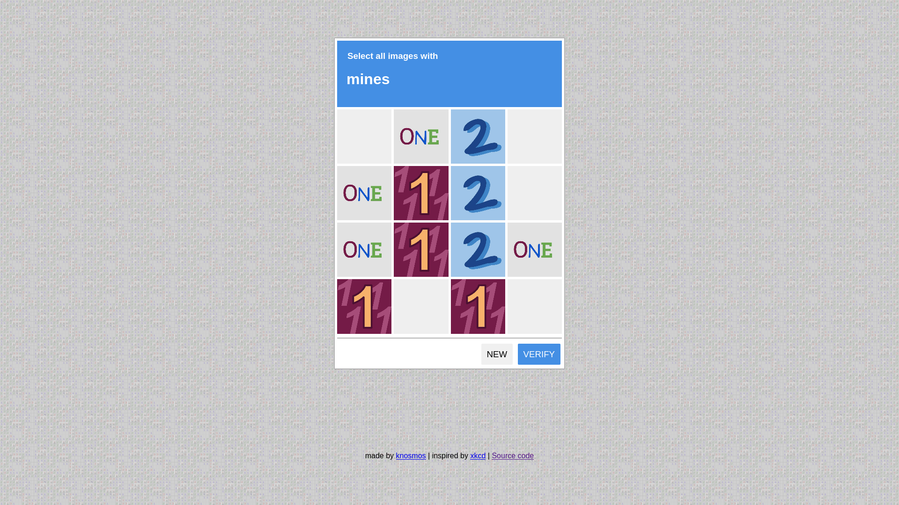

# Minesweeper Captcha
*Inspired by [xkcd#2496](https://xkcd.com/2496/)*

Are your users tired of endlessly clicking on boxes with traffic lights? Well, Minesweeper Captcha is for you! In addition to stopping bots not equipped with minesweeping technology, it provides exciting mental stimulation for users.

Online demo (local to fork): [https://tutacat.github.io/mine-captcha/](https://tutacat.github.io/mine-captcha/)

*Note: This is not intended for actual use. It features zero security whatsoever and will annoy the heck out of anyone trying to post a comment.*
*Note: Computers are also much better and faster at completing minesweeper than humans*
